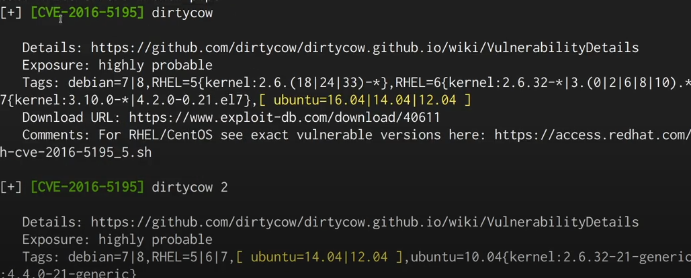
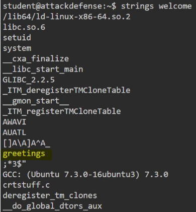

# Kernel Exploit:

- https://github.com/mzet-/linux-exploit-suggester
- upload les.sh to target using meterpreter and run the file

- eg. dirtycow 2 exploit creates a new user with escalated perms with a password. 
- compile on attacker machine or victim machine (former may not work).

# Cron jobs:

- look for a script file (.sh) which normal user can edit and can run as root.

- `printf '#! /bin/bash\necho "student ALL=NOPASSWD:ALL" >> /etc/sudoers' > /usr/local/share/copy.sh`
- this will create a script which will allow student user to run sudo without password

# Exploiting setuid programs:

- setuid bit looks like:

- this means this binary along with all child processes run with root privs
- investigate binary with - strings ./welcome

- since this binary is calling greetings binary, we delete the ./greetings binary
- and replace with /bin/bash binary
- this will run /bin/bash as root
- run the welcome binary, it should give root shell

# Weak Permissions:

- `find / -not -type l -perm -o+w`
- use openssl to generate encrypted linux passwords (can be substituted in shadow file)
	- `openssl passwd -<1/2/3/4/5/6> -salt abc <cleartext password>`
	- -1 means weakest algorithm, -6 means strongest

# Sudo Misconfig:

- `sudo -l` : programs that current user can run as root
- eg. man -> sudo man cat -> type !/bin/bash -> opens shell as root
